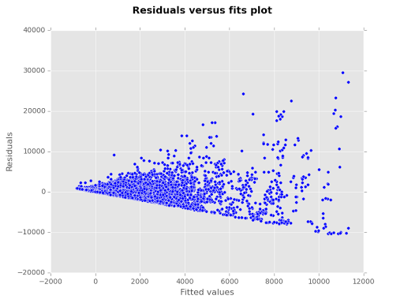
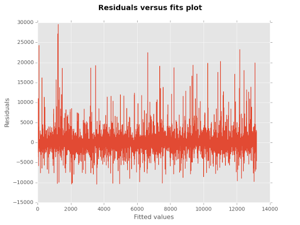
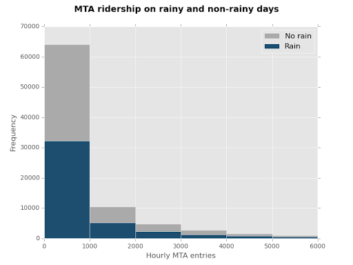
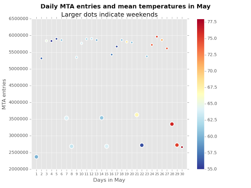

#Project 2: Analyzing the NYC Subway Dataset
##Background information
In a Stroop task, participants are presented with a list of words, with each word displayed in a color of ink. The participant’s task is to say out loud the color of the ink in which the word is printed. The task has two conditions: a congruent words condition, and an incongruent words condition. In the congruent words condition, the words being displayed are color words whose names match the colors in which they are printed. In the incongruent words condition, the words displayed are color words whose names do not match the colors in which they are printed. In each case, we measure the time it takes to name the ink colors in equally-sized lists. Each participant will go through and record a time from each condition.

**Dataset:** [View CSV](stroopdata.csv)

##1. Statistical test

####1.1 Which statistical test did you use to analyze the NYC subway data? Did you use a one-tail or a two-tail P value? What is the null hypothesis? What is your p-critical value?
I used the Mann-Whitney U-test with a two-tail P value. H0: If we draw randomly from two distributions, neither is more likely to generate a higher value. In the case of this study, if we looked at a random day from the rain sample and the no-rain sample, neither is more likely to show a higher ridership.

**P-critical value:** 0.05

####1.2 Why is this statistical test applicable to the dataset? In particular, consider the assumptions that the test is making about the distribution of ridership in the two samples.
The ridership data is not normally distributed. Although the large number of samples allowed for the use of the Welch's T-test to analyze the data, I opted for the Mann-Whitney U-test which does not make the assumption that the data follows a Gaussian distribution, and is not as susceptible to outliers that may be present in the dataset.

####1.3 What results did you get from this statistical test? These should include the following numerical values: p-values, as well as the means for each of the two samples under test.

**Mean with rain:** 1105.45

**Mean without rain:** 1090.28

**P-value:** 0.049

####1.4 What is the significance and interpretation of these results?
The P-value of the Mann-Whitney U test is 0.05 so we can conclude that the difference between the two means is not due to chance and applies to the entire population. We can thus reject the null hypothesis that rain has no impact on MTA subway ridership. The means of the two samples suggest that ridership increases when it is raining.

##2. Linear regression

####2.1 What approach did you use to compute the coefficients theta and produce prediction for ENTRIESn_hourly in your regression model:
OLS using Statsmodels

####2.2 What features (input variables) did you use in your model? Did you use any dummy variables as part of your features?
* rain, weekend, meantempi, meanpressurei
* UNIT and Hour dummy variables

I treated Hour as a dummy variable because we are not concerned about the passage of time as much as we are concerned about what time it is and how that affects the outcome variable.

####2.3 Why did you select these features in your model? We are looking for specific reasons that lead you to believe that the selected features will contribute to the predictive power of your model.
The Hour of day appeared to be an obvious variable that is bound to have effect on ridership. I also manually added a 'weekend' variable because my intuition suggested that it should have big impact on ridership (presumably, many people stay at home during the weekend). I then thought that rain, temperature and pressure may all have an effect on ridership because they can 1. encourage you to take the MTA instead of walking and 2. affect your well-being and thus the likelyhood going out and taking the MTA. The addition of these parameters increased the R2, confirming my assumptions.

####2.4 What are the parameters (also known as "coefficients" or "weights") of the non-dummy features in your linear regression model?
```
rain              -54.632103
weekend          -571.970508
meantempi         -10.086360
meanpressurei    -328.596009
```

####2.5 What is your model’s R2 (coefficients of determination) value?
0.53

####2.6 What does this R2 value mean for the goodness of fit for your regression model? Do you think this linear model to predict ridership is appropriate for this dataset, given this R2  value?
R^2 measures the distance between the data and the fitted regression line, that is, the percentage of the variation that is explained by the model. In this case, R^2 of 0.49 indicates that only 49% of the variation is explained by our model. To confirm the goodness of fit, I have generated a residuals vs. fitted values plot.

 

The residuals vs. fits plots exhibit heteroscedasticity, that is, a strong positive correlation between the absolute value of the residuals and the predictions. This indicates that our model could be improved. We can also observe a cyclic pattern in the residuals, which suggests that a non-linear model is probably a better fit for this dataset.

##3. Visualization



The histogram of ridership on rainy and non-rainy days shows that both distributions are not normally-distributed. 

**Note:** The x-axis has been truncated at 6,000, cutting off outliers in the long tail which extends beyond 50,000. Also, the sample sizes differ significantly — there have been fewer rainy days than non-rainy days in May. These histograms thus cannot serve for accurate comparison and do <em>not</em> lead to the conclusion that ridership increased when it rained.



The scatter plot compares ridership on different days in May. The colour indicates the mean temperature that day, ranging from 55 to 77.6F. Markers that fall on weekends (Saturday, Sunday) have been doubled in size. 

This plot suggests that there is little or no correlation between mean temperature and ridership. On the other hand, there is a clear pattern throughout the month indicating a strong fall in ridership during the weekends.

##4. Conclusion

####4.1 From your analysis and interpretation of the data, do more people ride the NYC subway when it is raining or when it is not raining?
More people ride the subway when it is not raining.

####4.2 What analyses lead you to this conclusion? You should use results from both your statistical tests and your linear regression to support your analysis.
The Mann-Whitney U test rejects the null hypothesis that if we looked at a random day from the rain sample and the no-rain sample, neither is more likely to show a higher ridership. The mean values of the two samples (with rain: 1105.45, without rain: 1090.28) show that more people ride the subway when it rains.

Linear regression suggests the opposite of the statistical test. Theta -67.987726 of the rain variable indicates that there is a negative relation between rain and ridership. However, other variables such as whether the day falls on a weekend, have much stronger thetas, and thus a stronger effect on ridership than the rain variable. Additionally, analysis of the residuals versus fits plot shows cyclicity and strong heteroscedasticity in our model, indicating that it could be improved.

##5. Reflection

####5.1 Please discuss potential shortcomings of the methods of your analysis, including the dataset and analysis.
The turnstile dataset only include ridership information on the month of May. Data across the entire year, or at least several seasons, would greatly improve the accuracy of our predictions. 

Processing power limitations only allowed regression analysis of part of the data, but the amount of data analyzed has nevertheless been large enough to make accurate predictions. Stochastic gradient descent analysis would have allowed me to analyze a larger portion of the data that the orderinary least squares approach, but at the expense of precision. 

Furthermore, the dataset includes numerous variables that may exhibit colinearity, such as mintempi, maxtempi and meantempi. 

Finally, the predictions have been limited by the use of linear regression analysis. Some of the predictor variables may in fact have a non-linear effect and a non-linear model could thus provide for more accurate predictions.

####5.2 (Optional) Do you have any other insight about the dataset that you would like to share with us?
It would be great to have location data on the individual turnstiles in order to plot them on a map.